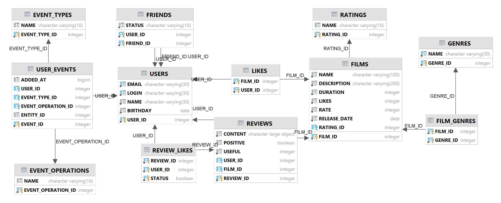
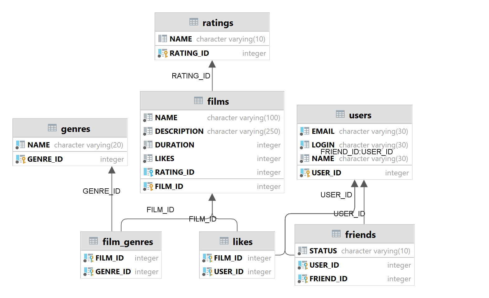

# # Групповой проект
## #1 Создал ветку add-mark
### 1.1 Создал ветку add-mark-likes-rate
# Актуальная схема DB для проекта

Добавлены поля в таблицу films 
- rate_score INTEGER DEFAULT 0,
- average_rate REAL,

Добавлено поле в таблицу likes
- rate INTEGER DEFAULT 10,

Если Like приходит без rate => тогда выставляем максимум 10

Операции 
- Add - добавить
- Remove - удалить
- Update -> если при добавлении лайк уже стоит, тогда обновляем значение rate

**Во время всех этих операций производится перерасчет полей в films**
- 
- добавлена проверка на валидный rate От 1 до 10
- добавлены тесты postman: postman\develop-add-mark-LikesRate.json

### #1.2 Сделал Рекомендации
### #1.3 Сделал сортировку по average_rate

## #1 Создал ветку develop

# #11 Спринт Финальное задание
## #4 Тестирование
-  интеграционное тестирование

## #3 Работа с DAO
1. Вам пригодятся созданные ранее интерфейсы UserStorage и FilmStorage. 
Напишите для них новую имплементацию — например, UserDbStorage и FilmDbStorage. 
2. Эти классы будут DAO — объектами доступа к данным.

## #2 Создание базы данных
- сейчас вы будете работать с другой базой. Она называется H2.
- подключить зависимости
- Сконфигурируйте базу данных для рабочего режима с помощью файла настроек **application.properties**
- Соберите SQL-запросы, формирующие структуру вашей базы, в отдельный файл в **src/main/resources** с названием **schema.sql** — так схема будет создаваться заново при каждом запуске приложения.
- Если вам нужны некоторые данные в базе, их инициализация обычно описывается в файле **data.sql**

## #1 Организация
- В этом спринте вы будете работать в новой ветке. Назовите её add-database. Название ветки важно, потому что к ней привязаны тесты.

# #10 спринт Создание схемы
# #7 Задание для взаимопроверки
В этом задании вы будете проектировать базу данных для проекта, основываясь на уже существующей функциональности. Вносить какие-либо изменения в код не потребуется.

# #4 Полный REST

- Убедитесь, что ваше приложение возвращает корректные HTTP-коды
    - 400 — если ошибка валидации: ValidationException;
    - 404 — для всех ситуаций, если искомый объект не найден;
    - 500 — если возникло исключение.

# #3 Новая логика

Обеспечим возможность пользователям добавлять друг друга в друзья и ставить фильмам лайки.

- Создайте UserService, который будет отвечать за такие операции с пользователями, как
    - добавление в друзья,
    - удаление из друзей,
    - вывод списка общих друзей.
- Создайте FilmService, который будет отвечать за операции с фильмами,
    - добавление и удаление лайка,
    - вывод 10 наиболее популярных фильмов по количеству лайков.
    - каждый пользователь может поставить лайк фильму только один раз.
- Добавьте к ним аннотацию @Service — тогда к ним можно будет получить доступ из контроллера.

# #2 Архитектура

- Вынесите хранение данных о фильмах и пользователях в отдельные классы.
- Назовём их «хранилищами» (англ. storage) — так будет сразу понятно, что они делают.
- Создайте интерфейсы **FilmStorage** и **UserStorage**, в которых
  будут определены методы: _**добавления, удаления и модификации объектов**_.
- Создайте классы InMemoryFilmStorage и InMemoryUserStorage, имплементирующие новые интерфейсы, и перенесите туда всю
  логику хранения, обновления и поиска объектов.
- Добавьте к InMemoryFilmStorage и InMemoryUserStorage аннотацию @Component, чтобы впоследствии пользоваться внедрением
  зависимостей и передавать хранилища сервисам.

- Чтобы объединить хранилища, создайте новый пакет storage. В нём будут только классы и интерфейсы, имеющие отношение к
  хранению данных.

# #1 Наводим порядок в репозитории

- Создайте новую ветку, которая будет называться **add-friends-likes**

# Нужны отзывы пользователей.

А для улучшения рекомендаций по просмотру хорошо бы объединить пользователей в комьюнити.

В этот раз улучшим API приложения до соответствия REST, а также изменим архитектуру приложения с помощью внедрения
зависимостей.

# #6 Тестирование

- Добавьте тесты для валидации

# #5 Логирование

- Воспользуйтесь библиотекой slf4j
- объявляйте логер для каждого класса
- акже можете применить аннотацию @Slf4j

# #4 Валидация

- **Film**
    - название не может быть пустым;
    - максимальная длина описания — 200 символов;
    - дата релиза — не раньше 28 декабря 1895 года;
    - продолжительность фильма должна быть положительной.
- **User**
    - электронная почта не может быть пустой и должна содержать символ @;
    - логин не может быть пустым и содержать пробелы;
    - имя для отображения может быть пустым — в таком случае будет использован логин;
    - дата рождения не может быть в будущем.

# #3 Хранение данных / REST-контроллеры

- пакет controller
- Создайте два класса-контроллера
    - **FilmController**
    - **UserController**
- Добавьте в классы-контроллеры эндпоинты с подходящим типом запроса

# #2 Модели данных

- Создайте пакет **model**
- Добавьте в него два класса — **Film** и **User**
- добавить поля для Film
- добавить поля для User
- прописать Lombok **@Data**

# #1 Создаем собственную ветку

- В репозитории создайте ветку *controllers-films-users*
- Создайте заготовку проекта с помощью *Spring Initializr*

# java-filmorate

Template repository for Filmorate project.
